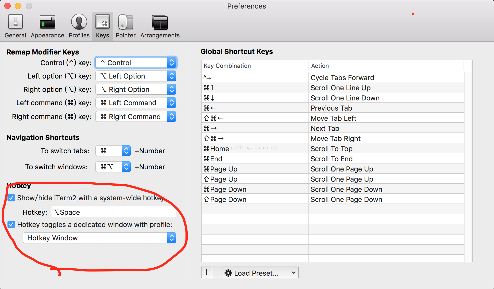
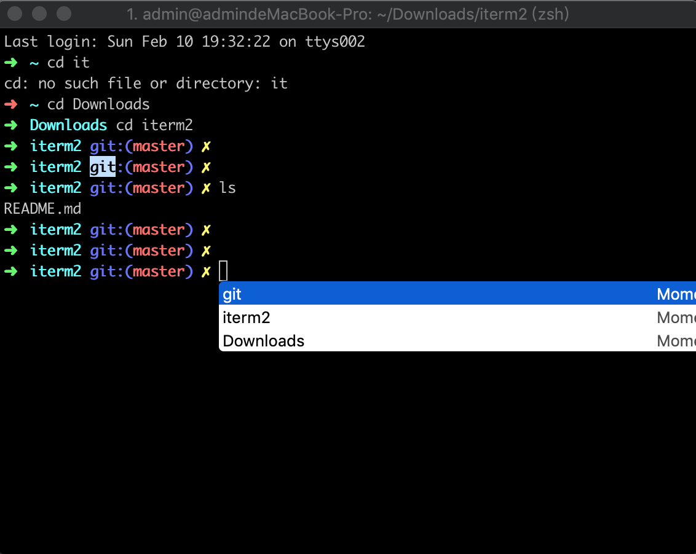

# macOS 10.14.3 item2 zsh

```
echo .DS_Store >> .gitignore
sudo su
chsh -s /bin/zsh
#还原
#chsh -s /bin/bash
cat /etc/shells
```

Iterm2 下载在software里

## 安装 oh my zsh

Zsh和bash一样，是一种Unix shell，但大多数Linux发行版都默认使用bash shell。但Zsh有强大的自动补全参数和自定义配置功能等等，Github地址：<https://github.com/robbyrussell/oh-my-zsh>，可以让我们非常快速的上手zsh。不得不说，这个oh my zsh真的是牛逼哄哄，去看看上面的[star](https://www.baidu.com/s?wd=star&tn=24004469_oem_dg&rsv_dl=gh_pl_sl_csd)就知道了。个人推荐使用[curl](https://www.baidu.com/s?wd=curl&tn=24004469_oem_dg&rsv_dl=gh_pl_sl_csd)自动安装，执行命令行如下：

```
curl -L https://github.com/robbyrussell/oh-my-zsh/raw/master/tools/install.sh | sh
```

## 1.选中即复制

在iTerm2中，直接用鼠标选中某个单词或者一行命令，那么就已经被复制了。不需要在去按command+C命令了。

## 2.屏幕分隔

这个是我最喜欢的iTerm2的功能，分隔成多个屏幕，只要你电脑的屏幕足够大，想分多少个屏幕都可以。可以同时进行命令行操作，而不会像只有在一个屏幕时，因为一个命令或者网络下载阻塞了，而不能执行其他命令了。如果你同时想去执行很多命令，那么，do it.

command+d:垂直分割；

command+shift+d:水平分割

## 3.快速唤出

这个同样是我很喜欢的功能，炫酷到无法阻挡。设置好系统热键之后，只要按快捷键，iTerm2就会从顶部以半透明的形式快速唤出，相当炫酷高效。个人因为经常使用iTerm2，所以设置了热键为：option+空格键。大家也可以根据自己的喜好设置快捷键。



使用快捷键快速唤出的效果。。。貌似是直接浮动在窗口上的，我截不了屏。。。大家尝试去感受下。

## 4.显示复制历史

使用快捷键shift+command+h,快速显示出我复制过的历史记录，你可以快速选择使用。




## 5.全屏切换

command+enter,可以快速实现全屏与正常窗口大小的切换，非常方便。